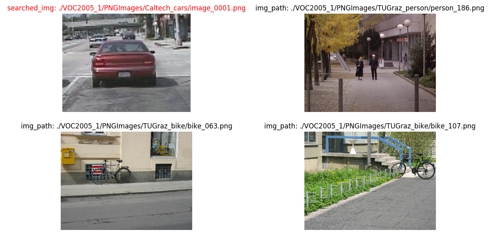
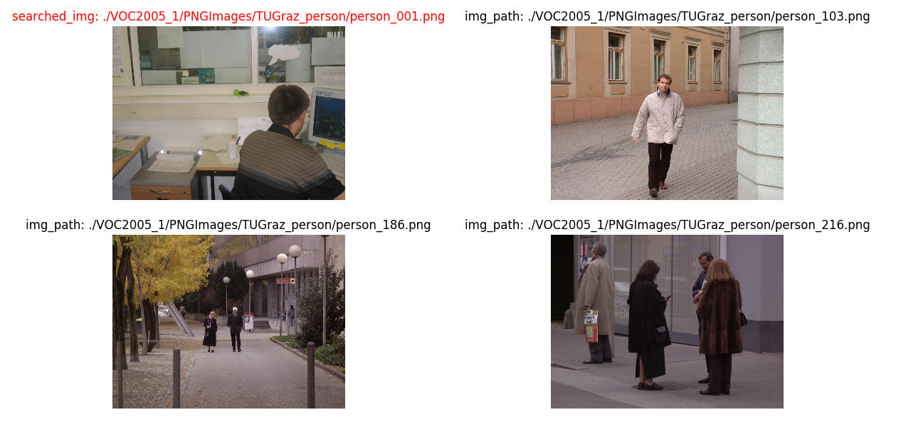
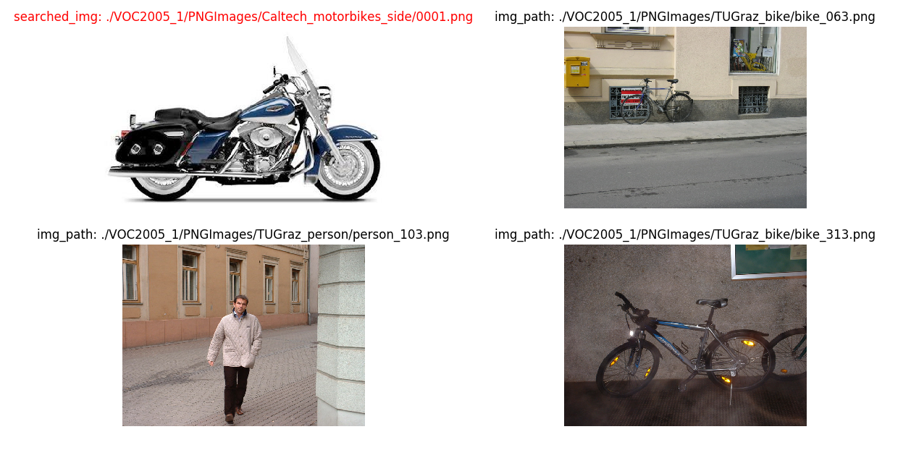
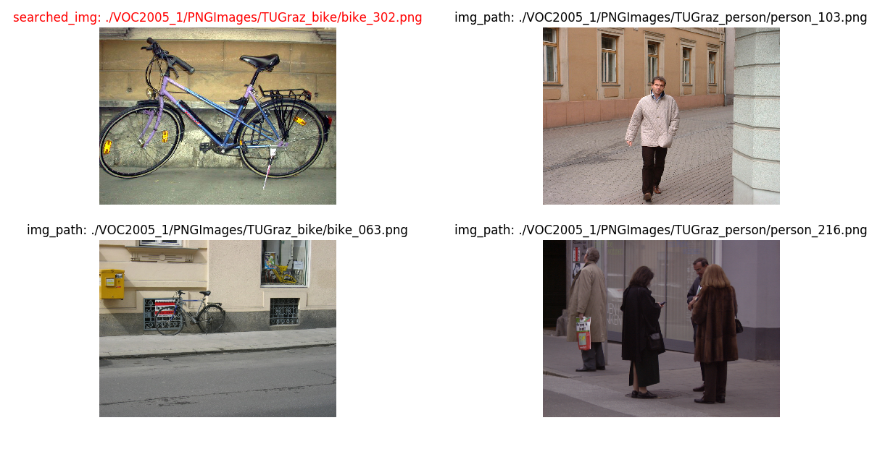
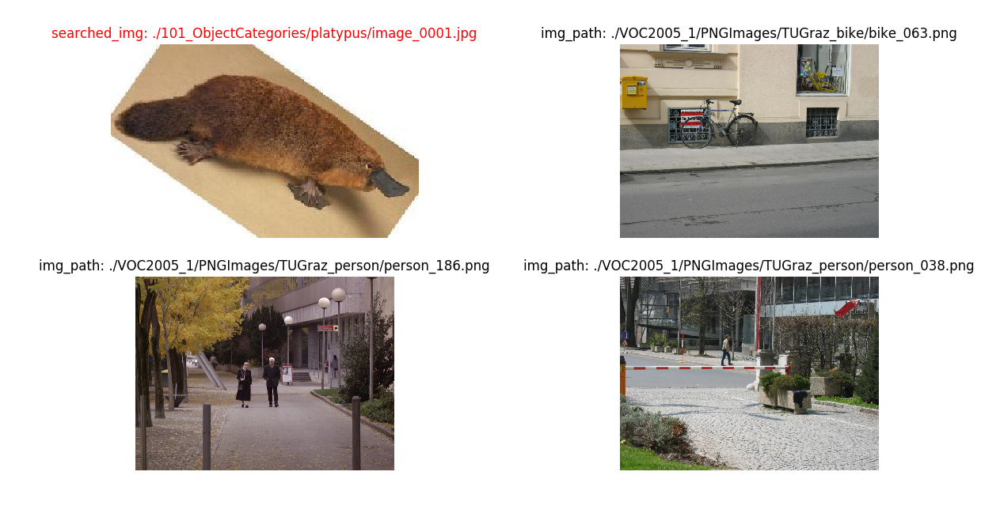
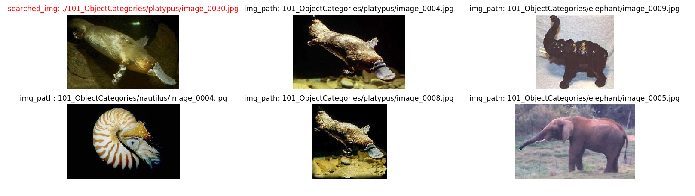
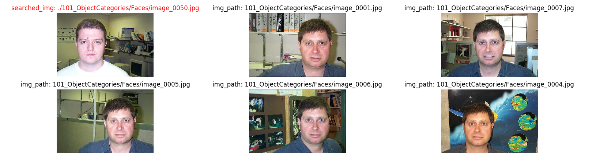
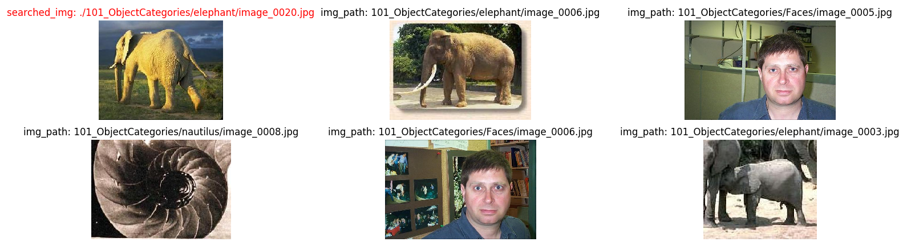
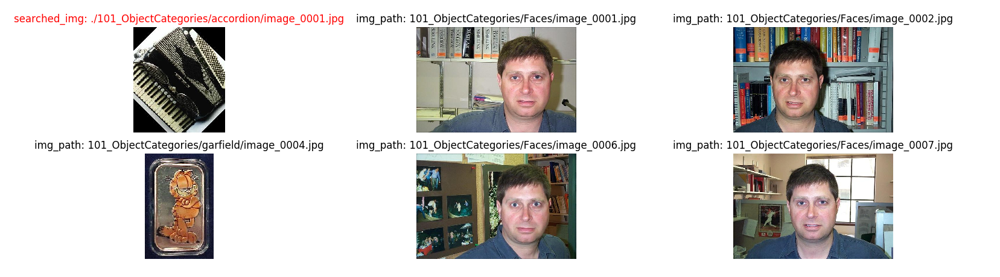

# visao3-3
## Elisa Malzoni

### Executando o programa
Para criar o vocabulário, rode `create_vocab.py`, que guarda a contagem e o vocabulário em arquivos. Não será necessário, já que os arquivos então neste repositório.

Para rodar o programa:

`python3 similar_images.py {imagem a ser buscada} {tipo de similaridade(bovw|poi)} [show` 

`show` - opcional, mostra as imagens encontradas

Exemplo de uso:

`python3 similar_images.py ./101_ObjectCategories/platypus/image_0030.jpg bovw show`

### Desempenho
#### Points of Interest
Busca de 4 imagens de categoria exixtente no banco:

  - Busca 1 - carro

  - Busca 2 - pessoa

  - Busca 3 - moto lateral

  - Busca 4 - bicicleta

Busca de imagem de categoria diferente das do banco:

  - ornintorrinco

#### Bag of Visual Words
Busca de 3 imagens de categoria exixtente no banco:

  - Busca 1 - ornintorrinco

  - Busca 2 - pessoa

  - Busca 3 - elefante

Busca de imagem de categoria diferente das do banco:

  - acordeão

